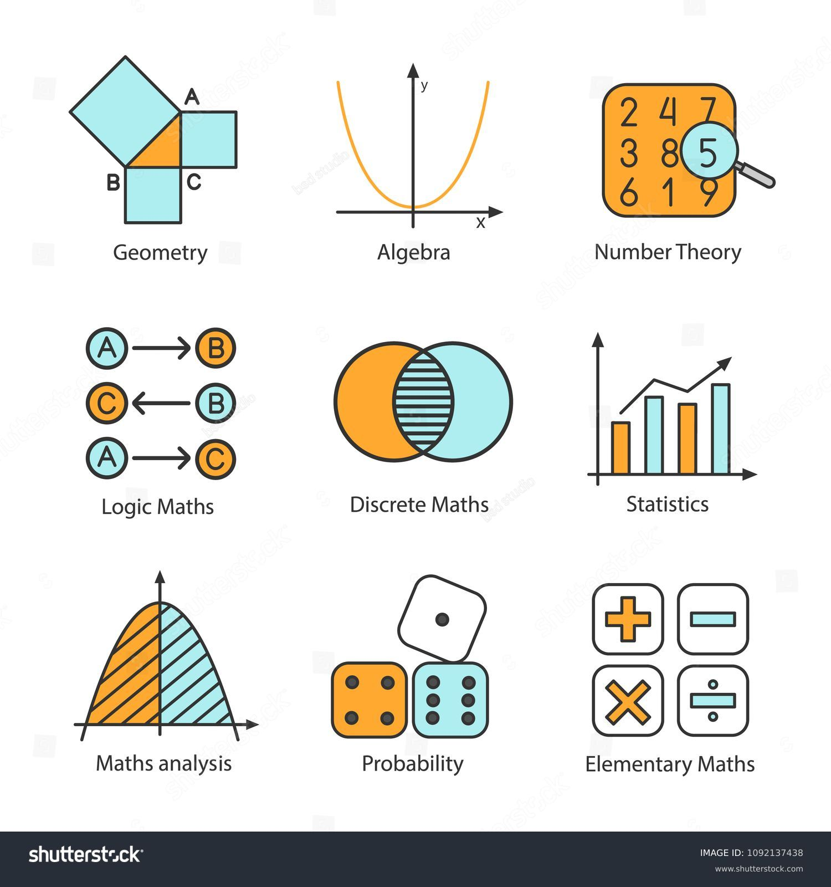
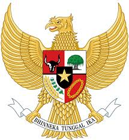
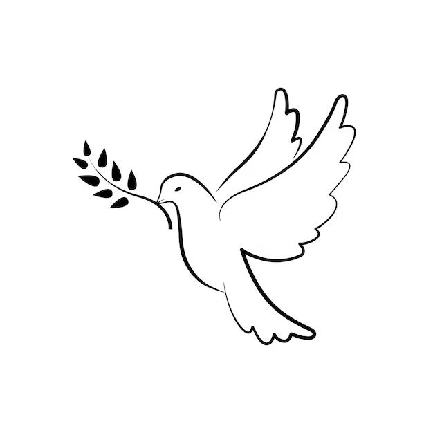
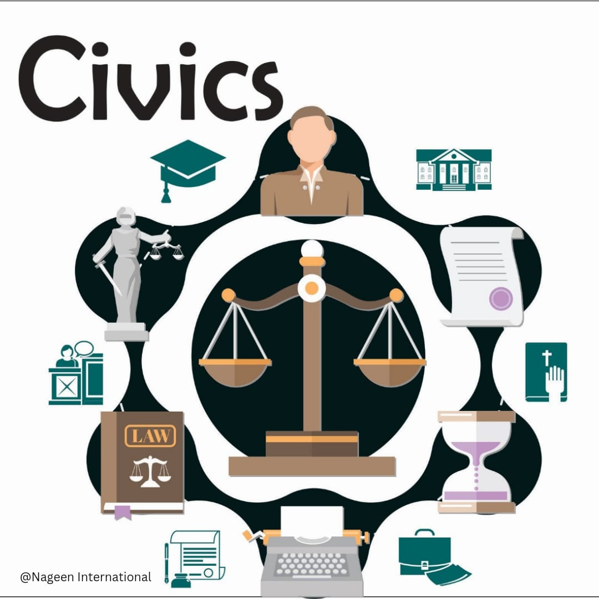

## Semester 1

### All the materials below has materials original from the University

### 1st Semester Table
| Status | Code | Course | Credits (SKS) | Minimum Passing Grade (KKM) | Description | Prerequisite
| --- | --- | --- | --- | --- | --- | ---
| Compulsory (Wajib) | [IF130](IF130/) | [Programming Fundamentals](#programming-fundamentals---if130) | 3 SKS (5.04 ECTS) | 55 (C) | This course discusses the design of structured programs, using flowchart and pseudocode, which includes branching, iteration, desk checking, and modular. | N/A
| Compulsory (Wajib) | [IF120](IF120/) | [Discrete Mathematics](#discrete-mathematics---if120) | 3 SKS (5.04 ECTS) | 55 (C) | Discrete Mathematics aims to teach students to know and understand the basic concepts of Discrete Mathematics. Some of the materials taught in this course include the basic ideas of sets; Mathematical logic and proof; basic concepts of functions, sequences, and series; relations and relation matrices; introduction to number theory; calculation method; discrete opportunities; recurrence relation; graph and tree theory; and Boolean algebra and circuit combinatorial. | N/A
| Compulsory (Wajib) | [CE121](CE121/) | [Linear Algebra](#linear-algebra---ce121) | 3 SKS (5.04 ECTS) | 55 (C) | This course covers matrix theory and linear algebra, emphasizing topics useful in computer engineering field | N/A
| Compulsory (Wajib) | [CE232](CE232/) | [Digital System](#digital-systems---ce232) | 3 SKS (5.04 ECTS) | 55 (C) | This course covers basic digital system including concept of digital system, numbering system and conversion, logic simplification, combination circuit, and sequential circuit | N/A
| Compulsory (Wajib) | [UM162](CE232/) | [Pancasila](#pancasila---um162) | 2 SKS (3.36 ECTS) | 55 (C) | This course discusses Pancasila as the basic values of philosophy (philosophical grondslag), the soul of the nation (volksgeist) or the identity of the nation (innerself of nation), ideology of Indonesia, and way of life of the real Indonesia. | N/A
| Compulsory (Wajib) | [UM152](UM152/) | [Religion](#religion---um152) | 2 SKS (3.36 ECTS) | 55 (C) | This course discusses the Divine Godhead as taught by every Religion in Indonesia and its implications on human life, upholding universal values. | N/A
| Compulsory (Wajib) | [UM163](UM163/) | [Civics](#civics---um163) | 2 SKS (3.36 ECTS) | 55 (C) | This course develops students' basic competencies to become scientists and professionals who have a sense of nationality and love of the motherland; democratic society; become competent citizens, disciplined, and actively participate in building a peaceful life based on the Pancasila value system.| N/A
| Compulsory (Wajib) | [UM122](UM122/) | [English 1 : Composition](#english---um1122) | 2 SKS (3.36 ECTS) | 55 (C) | This course discusses the elements of English to enrich the vocabulary, improve the pronunciation of words and improve students' knowledge related to sentence construction, paragraphs and texts that are focused on the development of reading skills, vocabulary skill-building and vocabulary learning strategies. | N/A

---

### Programming Fundamentals - IF130

[Click Here for the Full Module](IF130/Module-Handbook-24-IF130-Programming-Fundamentals.pdf)

Materi yang akan dipelajari:
1. Algorithm
2. Selection control structure: definition, flowchart and pseudocode
3. Repetition control structure: definition, flowchart and pseudocode
4. Modular programming: definition, flowchart and pseudocode
5. Introduction to programming concepts with the C programming language
6. Introduction to input and output in the C programming language
7. Selection control structure in C programming language
8. Repetition control structure in C programming language
9. Modular programming in C programming language
10. Pointers in C programming language
11. Arrays in the C programming language.

**Pemegang Modul:** Januar Wahjudi

**Metode Pembelajaran**: Lektur & Demonstrasi

**Bahasa**: Inggris & Indonesia

**SKS:** 3 SKS (5.04 ECTS)

**Jumblah Jam:** 136.08
- 35.01 hours of synchronous lecture.
- 84.06 hours of self-study and assignments in the form of essays.
- 17.01 hours related to exam and self study

**Asasmen:** Proyek & Written Test

**Distribution:**
- 30% Assignment
- 30% Ujian Tengah Semester
- 40% Ujian Akhir

**KKM:** 55 (C)

**Materi:**
1. [Gaddis, Tony, 2019, Starting out with programming logic & design, Fifth edition, Pearson Education, Inc.](https://raw.githubusercontent.com/Not-Baguette/CS-uni-materials/963ca82bdff042fb64bab37c1e14352b9d062658/sem1/IF130/0134801156.pdf)
2. [Hanly, Jeri R. and Koffman, Elliot B., 2013, Problem Solving and Program Design in C, Seventh Edition, Pearson Education, Inc.](https://raw.githubusercontent.com/Not-Baguette/CS-uni-materials/963ca82bdff042fb64bab37c1e14352b9d062658/sem1/IF130/Problem%20Solving%20and%20Program%20Design%20in%20C%20(Seventh%20Edition)%20%5BEnglishOnlineClub.com%5D.pdf)
5. [Deitel, Paul and Deitel, Harvey, 2016, C How to Program, Eighth Edition, Pearson Education, Inc.](https://raw.githubusercontent.com/Not-Baguette/CS-uni-materials/963ca82bdff042fb64bab37c1e14352b9d062658/sem1/IF130/c_how_to_program_with_an_introduction_to_c_global_edition_8th_edition.pdf)
---

### Discrete Mathematics - IF120

[Click Here for the Full Module](IF120/Module-Handbook-26-IF120-Discrete-Mathematics.pdf)

Materi yang akan dipelajari:
1. Sets
2. Logic
3. Proofs
4. Functions and Sequences
5. Relations and Matrices of Relations
6. Number Theory
7. Counting Methods
8. Discrete Probability
9. Recurrence Relations
10. Graph 1 (Basic)
11. Graph 2 (Advanced)
12. Trees 1 (Basic)
13. Trees 2 (Advanced)
14. Combinational Circuits and Boolean Algebra

**Pemegang Modul:** Angga Aditya Permana

**Metode Pembelajaran**: Lecture

**Bahasa**: Indonesia

**SKS:** 3 SKS (5.04 ECTS)

**Jumblah Jam:** 136.08
- 35.01 hours of synchronous lecture.
- 84.06 hours of self-study and assignments in the form of essays.
- 17.01 hours related to exam and self study

**Asasmen:** Written Test

**Distribution:**
- 30% Assignment
- 30% Ujian Tengah Semester
- 40% Ujian Akhir

**KKM:** 55 (C)

**Materi:**
- Materi Utama:
1. [Johnsonbaugh, R., 2005, Discrete Mathematics, New Jersey: Pearson Education, Inc](https://raw.githubusercontent.com/Not-Baguette/CS-uni-materials/1ce75fcc9f6248de4c76bd845b667ce47d3d3757/sem1/IF120/Discrete%20Mathematics%208th%20Edition.pdf)
2. [Rosen, Kenneth H., 2005, Discrete Mathematics and Its Applications, 6th edition, McGraw-Hill](https://raw.githubusercontent.com/Not-Baguette/CS-uni-materials/0aa371b1e6c1cc23182654de10ccad6eb81a8149/sem1/IF120/rosen_discrete_mathematics_and_its_applications_7th_edition_compressed.pdf)
3. Hansun, S., 2021, Matematika Diskret Teknik, Deepublish

- Materi Pembantu:
1. [Lipschutz, Seymour, Lipson, Marc Lars, Schaum’s Outline of Theory and Problems of Discrete Mathematics, McGraw-Hil](https://raw.githubusercontent.com/Not-Baguette/CS-uni-materials/0aa371b1e6c1cc23182654de10ccad6eb81a8149/sem1/IF120/Schaum's_Outlines_-_Discrete_Mathematics%2C_3rd_Ed._by_Seymour_Lipschutz.pdf)
2. Liu, C.L., 1995, Dasar-Dasar Matematika Diskret, Jakarta: Gramedia Pustaka Utama.
---

### Linear Algebra - CE121

[Click Here for the Full Module](CE121/Module-Handbook-28-CE121-Linear-Algebra.pdf)

Materi yang akan dipelajari:
- Linear combination,
- Linear independence,
- Basis, and
- Vector dimension operation (C3)

**Pemegang Modul:** Aminuddin Rizal, S.T., M.Sc., Nabila Husna Shabrina, S.T, M.T., Dr. Hugeng, S.T., M.T., Ariana Tulus Purnomo, S.T., M.Sc.

**Metode Pembelajaran**: Lektur, Pembelajaran Independen

**Bahasa**: Indonesia

**SKS:** 3 SKS (5.04 ECTS)

**Jumblah Jam:** 136.08
- 35.01 hours of synchronous lecture.
- 84.06 hours of self-study and assignments in the form of essays.
- 17.01 hours related to exam and self study

**Asasmen:** Written Test

**Distribution:**
- 40% Assignment & Quiz
- 25% Ujian Tengah Semester 
- 35% Ujian Akhir

**KKM:** 55 (C)

**Materi:**
1. [Howard Anton dan Chris Rorres. Elementary Linear Algebra. Application Version. 12 th edition. John Wiley & Sons, 2019](https://raw.githubusercontent.com/Not-Baguette/CS-uni-materials/a503107b2962b7ec60067143906a9b88263b8751/sem1/CE121/037-Elementary-Linear-Algebra-Applications-Version-Howard-Anton-Chris-Rorres-Edisi-1-2013.pdf)
2. [Poole, David Linear Algebra A Modern Introduction 4th Edition, Belmont: Thomson Higher Education, 2015](https://raw.githubusercontent.com/Not-Baguette/CS-uni-materials/a503107b2962b7ec60067143906a9b88263b8751/sem1/CE121/Y2h4u7_Linear_Algebra_A_Modern_Introduction_3.pdf)
---

### Digital Systems - CE232

[Click Here for the Full Module](CE232/Module-Handbook-33-CE232-Digital-Systems.pdf)

Materi yang akan dipelajari:
digital systems; number systems, logic gates, digital circuits (sequential, combinational), digital data format, and metode untuk mendesign system digital mudah:
1. Introduction to digital systems
2. Number systems
3. Boolean algebra
4. Logic gates
5. Simplifying logic equations
6. Number formats in digital systems
7. Fixed point and Floating point arithmetic
8. Combinational logic circuits
9. Sequential circuits
10. Sequential circuits design procedure
11. Application of combinatorial and sequential circuits

**Pemegang Modul:** Megantara Pura

**Metode Pembelajaran**: Lecture

**Bahasa**: English & Indonesia

**SKS:** 3 SKS (5.04 ECTS)

**Jumblah Jam:** 136.08
- 35.01 hours of synchronous lecture.
- 84.06 hours of self-study and assignments in the form of essays.
- 17.01 hours related to exam and self study

**Asasmen:** Written test

**Distribution:**
- 30% Assignment
- 30% Ujian Tengah Semester
- 40% Ujian Akhir

**KKM:** 55 (C)

**Materi:**
1. [M. Morris Mano, Digital Design, 6th Edition, Pearson, 2018](CE232/Digital%20Logic%20And%20Computer%20Design%20By%20M.%20Morris%20Mano%20(2nd%20Edition).pdf)
---

### Pancasila - UM162

[Click Here for the Full Module](UM162/Module-Handbook-01-UM162-Pancasila.pdf)

Materi yang akan dipelajari:
- Pancasila sebagai dasar filosofi (philosophical grondslag),
- Jiwa Bangsa (volksgeist) atau Identitas Bangsa (innerself of nation),
- ideologi Indonesia, and
- Gaya kehidupan yang benar sebagai Warga Indonesia.

**Pemegang Modul:** Suhendra, Simon Petrus Wenehenebun

**Metode Pembelajaran**: Lecture, Diskusi, Pembelajaran Independen

**Bahasa**: Indonesia

**SKS:** 2 SKS (3.36 ECTS)

**Jumblah Jam:** 90.72
- 23.34 hours of synchronous lecture.
- 56.04 hours of self-study and assignments in the form of mini projects.
- 11.34 hours related to exam and self study

**Asasmen:** Written Test & Performa

**Distribution:**
- 30% Assignment
- 20% Ujian Tengah Semester
- 30% Ujian Akhir
- 20% Sikap

**KKM:** 55 (C)

**Materi:**
1. [Majalah Sejarah Populer Daring](https://historia.id/)
---

### Religion - UM152

[Click Here for the Full Module](UM152/Module-Handbook-02-UM152-Religion.pdf)

Materi yang akan dipelajari:
Memahami moral dan menghormati perbedaan dengan menerima agama, norma, moral lain.

**Pemegang Modul:** Henry Stephen Sabari, Simon Wenehen, Ignasius Joko Suyanto, Christian Siregar, Johannes Mitakda

**Metode Pembelajaran**: Lecture, Discussion, Pembelajaran Independen

**Bahasa**: Indonesia

**SKS:** 2 SKS (3.36 ECTS)

**Jumblah Jam:** 90.72
- 23.34 hours of synchronous lecture.
- 56.04 hours of self-study and assignments in the form of mini projects.
- 11.34 hours related to exam and self study

**Asasmen:** Written Test & Performa

**Distribution:**
- 25% Assignment
- 25% Ujian Tengah Semester
- 30% Ujian Akhir Semester
- 20% Sikap & Quiz

**KKM:** 55 (C)

**Materi: (i give up on this one)**
1. Pendidikan Religiositas, Jakarta: UMN Press, 2018.
2. [Karen Amstrong, A Short History of Myth, Edinburg: Pentagram, 2005.](UM152/Karen%20Armstrong%20A%20Short%20History%20of%20Myth.pdf)
3. Olaf Schuman Dkk, Agama-Agama Memasuki Milenium Ketiga. Jakarta: Grasindo.2000
4. Allan Menzies. History of Religion. Yogyakarta: Indoloterasi.2015
5. Mukti Ali, Agama-agama di Dunia (Yog-yakarta: IAIN Sunan Kalijaga Press, 1988).
6. Mariasusai Dhavamony: Fenomenologi Agama: Yogyakarta: Kanisius. 1995
7. Dr. R. Soekmono: Pengantar Sejarah Kebudayaan Indonesia. Yogyakarta: Kanisius. 1981
8. Agus.M. Hardjana: Religiositas, Agama, Spiritualitas. Yogyakarta: Kanisius. 2005.
9. Al. Andang: Agama yang Berpijak dan Berpihak. Yogyakarta: Kanisius. 1998.
10. Franz Magnis- Suseno: Menalar Tuhan. Yogyakarta: Kanisius. 2006
11. Albertus Sujoko, MSC: Belajar Menjadi Manusia. Yogyakarta: Kanisius. 2008
12. Antonius A. Gea, Relasi dengan Tuhan, Jakarta: Elex Media Komputindo, 2006.
13. Fisdelis E. Waruwu, Membangun Budaya Berbasis Nilai, Yogyakarta: Kanisius, 2010.
---

### Civics - UM163

[Click Here for the Full Module](UM163/Module-Handbook-07-UM163-Civics.pdf)

Materi yang akan dipelajari:
Mempelajari untuk memikirkan Etika, Sensitivitas Sosial, efek non-teknikal, Kesehatan, keamanan, dan legalitas dalam aktivitas.

**Pemegang Modul:** KANON MOMMSEN WONGKAR, SRI HUTOMO, IWAN IRAWAN, AGUSTINUS SUGENG AGUS PRIYONO, QUSTHAN ABQARY HISAN FIRDAUS, FERRY DORINGIN, LAMBERTUS BERTO TUKAN, DAVID TOBING

**Metode Pembelajaran**: Lecture, Discussion, Pembelajaran Independen

**Bahasa**: Indonesia

**SKS:** 2 SKS (3.36 ECTS)

**Jumblah Jam:** 90.72
- 23.34 hours of synchronous lecture.
- 56.04 hours of self-study and assignments in the form of mini projects.
- 11.34 hours related to exam and self study

**Asasmen:** Lecture, Discussion, Pembelajaran Independen 

**Distribution:**
- 30% Aktivitas Sebelum/Sesudah Kelas
- 10% Aktivitas 
- 25% Ujian Tengah Semester
- 35% Ujian Akhir

**KKM:** 55 (C)

**Materi:**
1. [Alexander Frederik de Savornin Lohman. Onze Constitutie. Kemink, Utrecht. 1901](UM163/Onze%20Constitutie.pdf)
2. [Alexandros Stogiannos. The Genesis of Geopolitics and Friedrich Ratzel – Dismissing the Myth of Ratzelian Geodeterminism. Springer. Geneve. 2019](UM163/The%20Genesis%20of%20Geopolitics%20and%20Friedrich%20Ratzel-%20Dismissing%20--%20Alexandros%20Stogiannos%20--%20Historical%20Geography%20and%20Geosciences%2C%201st%20ed_%2C%202019%20--%209783319980348%20--%2006dfcd111564a661548e3ee0291a019d%20--%20Anna%E2%80%99s%20Archive.pdf)
3. [A. V. Dicey. An Introduction to The Study Of The Law Of The Constitution. Tenth Edition. Macmillan Press. London and Basingstoke. Reprinted 1979](UM163/An%20Introduction%20to%20The%20Study%20Of%20The%20Law%20Of%20The%20Constitution_compressed.pdf)
4. [Bikhu Parekh. Rethinking Multiculturalism – Cultural Diversity and Political Theory. Macmillan. London. 2000](UM163/Parekh_Rethinking_multiculturalism.pdf)
5. [Brian W. Blouet ed. Global Geostrategy. Mackinder and The Defence Of The West. Frank Cass. London New York. 2005](UM163/global-geostrategy-mackinder-and-the-defence-of-the-west-9780714685755-0714685755_compress.pdf)
6. [C.F. Strong. A History of Modern Political Constitution. GP Putnam & Sons. New York. 1963](UM163/A%20history%20of%20modern%20political%20constitution%20--%20ff9be9c2b512e1a249a424bec821c0cf%20--%20Anna%E2%80%99s%20Archive_2.pdf)
7. [Charles Louis De Secondat Baron De Montesquieu. De L’Esprit Des Loix. Chez Barilot Et Fils. Geneve. 1758](UM163/Montesquieu%20-%2004%20L'esprit%20des%20lois.pdf)
8. [Daniel PS Goh, Matilda Gabrielpillai, Philip Holden, dan Gaik Cheng Khoo eds. Race and Multiculturalism in Malaysia and Singapore. Routhledge. Oxon. 2009](UM163/Multiculturalism%20in%20Malaysia%20and%20singapore.pdf)
9. [Derek Heater, A History of Education For Citizenship. RoutledgeFalmer. New York. 2004](UM163/E103_%20History%20of%20and%20Philosophy%20of%20Education%20%5BDerek%20Heater%5D%20A%20History%20of%20Education%20for%20Citizens%20(BookFi).pdf)
10. [Direktorat Diseminasi Informasi, Deputi Pencegahan BNN. Buku Panduan Pencegahan penyalahgunaan Narkoba Sejak Dini. BNN. Jakarta. 2012](UM163/Buku-Pencegahan-Narkoba-Sejak-Usia-Dini.pdf)
11. [Douglas W. Blum. National Identity and Globalization – Youth, State, and Society in Post-Soviet Eurasia. Cambridge University Press. Cambridge. 2007](UM163/National%20Identity%20and%20Globalization.pdf)
12. [Graham Brooks, David Walsh, Chris Lewis, dan Hakkyong Kim. Preventing Corruption – Investigation, Enforcement, and Governance. Palgrave Macmillan. New York. 2013](UM163/Preventing%20Corruption%20%E2%80%93%20Investigation%2C%20Enforcement%2C%20and%20Governance.pdf)
13. [Hans Kelsen. Reine Rechtslehre. Osterreichische Staatsdrukerei. Wien. 1992](UM163/TEORI_HANS_KELSEN_TENTANG_HUKUM.pdf)
14. Iswan Kaputra, Dampak Otonomi Daerah di Indonesia: Merangkai Sejarah Politik dan Pemerintahan Indonesia. Obor. Jakarta. 2013
15. [John Locke. Two Treatises on Government and a Letter Concerning Toleration. Editor Ian Saphiro. Yale University Press. Connecticut. 2003](UM163/Locke.pdf)
16. Koninlijk Nederland. Territoriale Zee en Marietieme Kringen Ordonantie. S. 442. 1939
---
### English - UM1122

[Click Here for the Full Module](UM122/Module-Handbook-04-UM122-English-1.pdf)

Materi yang akan dipelajari:
Vocab, Pronunciation, Sentence construction, reading for academic writing

**Pemegang Modul:** Floreance Sahertian, Retnowati, Hendra Lim, Sylvie Meiliana, Rohaniyatul Makniyah

**Metode Pembelajaran**: Lecture, Pembelajaran Independen

**Bahasa**: English

**SKS:** 2 SKS (3.36 ECTS)

**Jumblah Jam:** 90.72 Jam
- 23.34 hours of synchronous lecture.
- 56.04 hours of self-study and assignments in the form of mini projects.
- 11.34 hours related to exam and self study

**Asasmen:** Written Test

**Distribution:**
- 30% Quiz & Assignment
- 25% Ujian Tengah Semester
- 35% Ujian Akhir
- 10% Afektif

**KKM:** 55 (C)

**Materi:**
1. Skillfull Reading and Writing MacMillan Academic Series by Mike Boyle and Lindsay Warwick - MacMillan Education London 2016.
2. Online exercises from macmillanskillfull.com
3. Forum Magazines, online article and Some videos from Youtube
