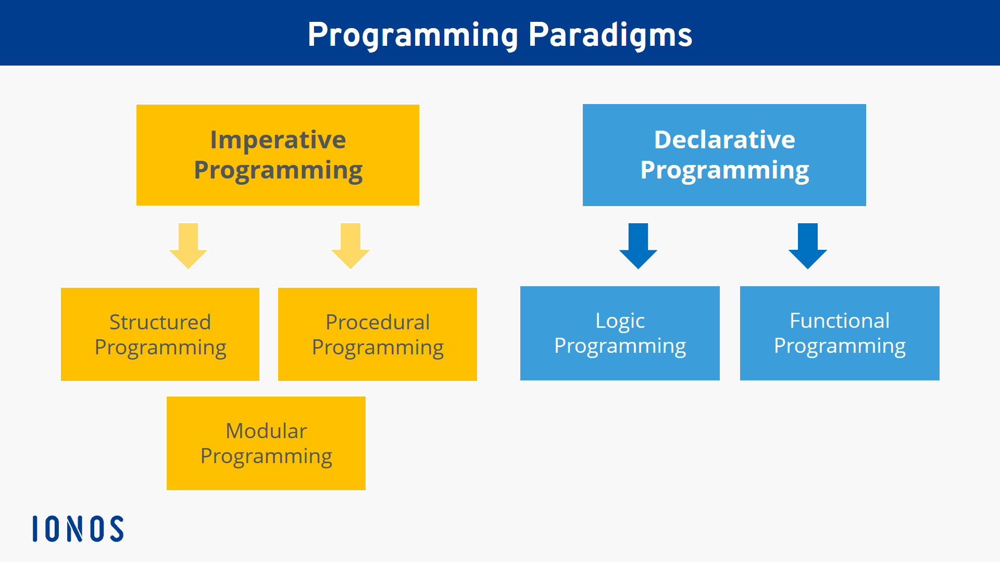
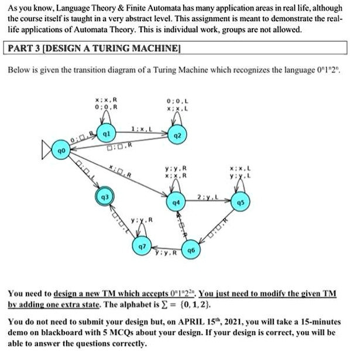
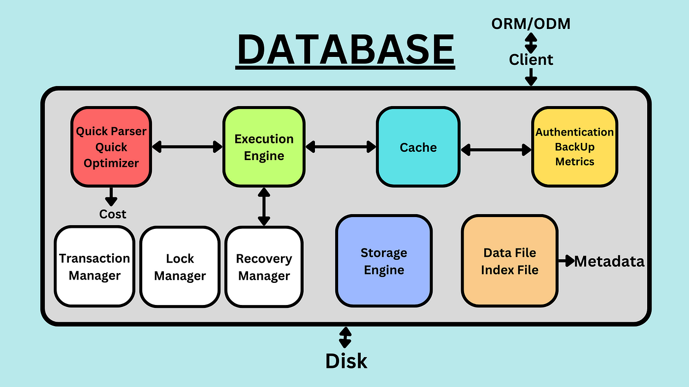
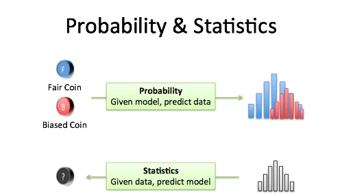

# Semester 3

## 3rd Semester Table
| Status | Code | Course | Credits (SKS) | Minimum Passing Grade (KKM) | Description | Prerequisite
| --- | --- | --- | --- | --- | --- | ---
| Compulsory (Wajib) | IF350 | [Software Engineering and Project Management](#software-engineering-and-project-management---if350) | 3 SKS (5.04 ECTS) | 55 (C) | This course student will apply the principles and approaches of software engineering theory and practice and manage them into a software project management that is efficient, within budget, quickly and of good quality. Student will develop a comprehensive project plan using the project of their choice. By the end of this course, student will understand why project management requires a high level of professionalism, and how to achieve that goal in future software projects | N/A
| Compulsory (Wajib) | [IF330](IF330/Module-Handbook-30-IF330-Web-Programming.pdf) | [Web Programming](#web-programming---if330) | 3 SKS (5.04 ECTS) | 55 (C) | This course covers web programming using server side scripting (eg. PHP) and database. | [IF231 Introduction to internet technology](../sem2/README.md#introduction-to-internet-technology---if231)
| Compulsory (Wajib) | IF331 | [Declarative programming](#declarative-programming---if331) | 3 SKS (5.04 ECTS) | 55 (C) | Declarative programming is a programming paradigm in which a computer program is formed based on a computational logic structure that can be used to solve a problem. In declarative programming, the source code of a program does not express the control flow of a problem solving. The purpose of using declarative programming is to minimize and eliminate side effects (in the form of bugs) from a program by describing what must be solved based on a problem domain. By understanding declarative programming, besides being able to create programs that are free from side effects, users can also write parallel programs more easily. Logical programming and functional programming are two parts of the declarative programming paradigm. This course will specifically discuss logic programming as part of declarative programming | [IF230 Algorithm and data structure](../sem2#algorithm--data-structure---if232)
| Compulsory (Wajib) | IF332 | [Language Theory & Automata](#language-theory--automata---if332) |  3 SKS (5.04 ECTS) | 55 (C) | This course studies the formal language, especially for the purposes of designing a compiler and a text processor. Automata are abstract machines that can recognize, accept, or generate a sentence in a particular language. The theory of language and automata is a theory of abstract machines, and is closely related to formal language theory | [IF120 Discrete Mathematics](../sem1#discrete-mathematics---if120)
| Compulsory (Wajib) | [IF351](IF351/Module-Handbook-23-IF351-Database-Systems.pdf) | [Database System](#database-system---if351) | 3 SKS (5.04 ECTS) | 55 (C) | This course covers the concepts, terminology, technique used in database management systems. | [IF120 Discrete Mathematics](../sem1#discrete-mathematics---if120)
| Compulsory (Wajib) | [CE319/IF360](CE319/Module-Handbook-21-CE319-Probability-and-Statistics.pdf) | [Probability & Statistics](#probability--statistics---ce319if360) | 2 SKS (3.36 ECTS) | 55 (C) | $${\color{red} Warning! \space This \space Course \space code \space has \space a \space conflicting}$$ $${\color{red} \space Course \space Code, \space proceed \space with \space caution!}$$ This course provides the basics of probability distribution and statistical analysis methods, relevant for students of information and communication technology. | N/A or [IF120 Discrete Mathematics](../sem1#discrete-mathematics---if120)
| Compulsory (Wajib) | [UM142](UM142/Module-Handbook-03-UM142-Indonesian-Language.pdf) | [Bahasa Indonesia](#bahasa-indonesia---um142) | 2 SKS (3.36 ECTS) | 55 (C) | This course covers the status and function of Bahasa Indonesia (Indonesian Language), traits of Bahasa Indonesia, variety / barrel of language, word and word formation, choice of words, sentences and sentence patterns, the effectiveness of sentences,paragraph development and paragraph sequencing, paraphrase, systematic scientific writing, writing excerpts with the APA system, completeness of papers, oral proficiency in presentations, interviews and arguments. | N/A

---

### Software Engineering and Project Management - IF350

_Full module is unavailable for this module, will be updated once I have more information_

Materi yang akan dipelajari: 
- Perencanaan Proyek aplikasi
- Prosedur untuk membuat kode yang berkualitas dan efesien

**Pemegang Modul:** N/A

**Metode Pembelajaran**: N/A (Prediction: Lecture, Demonstration)

**Bahasa**: N/A (Prediction: Indonesia)

**SKS:** 3 SKS (5.04 ECTS)

**Jumblah Jam (Prediction):** 136.08

Theory

- 23.34 hours of synchronous lecture.
- 56.04 hours of Self-study and assignments
- 11.34 hours related to exam and self study
  
Lab

- 23.35 hours of lab module (and in-class assistance)
- 16.34 hours of self-lab and assignments
- 5.67 hours related to exam and self study

**Asasmen:** N/A (Prediction: Proyek, Written Test)

**Distribution:** N/A

**KKM:** 55 (C)

**Materi:** N/A

---
### Web Programming - IF330

[Click Here for the Full Module](IF330/Module-Handbook-30-IF330-Web-Programming.pdf)

Materi yang akan dipelajari:

1. Server-side web applications
2. Basic programming with PHP
3. PHP variables & Functions
4. Object Based Programming with PHP
5. File Upload and File Manipulation
6. CRUD operations with PHP and MySQL
7. Application Security
8. PHP Framework: Laravel
9. Laravel Controllers & Views
10. Laravel Model & Migration
11. Eloquent Relationship
12. Forms, File Uploads, Validation
13. User Authentication
14. API Development

**Pemegang Modul:** Alexander Waworuntu

**Metode Pembelajaran**: Lecture, Problem-Based, Demonstration, Hands-on

**Bahasa**: Indonesia

**SKS:** 3 SKS (5.04 ECTS)

**Jumblah Jam:** 136.08

Theory

- 23.34 hours of synchronous lecture.
- 56.04 hours of Self-study and assignments
- 11.34 hours related to exam and self study

Lab

- 23.35 hours of lab module (and in-class assistance)
- 16.34 hours of self-lab and assignments
- 5.67 hours related to exam and self study

**Asasmen:** Written Test, Product Based, Portfolio

**Distribution:**
- 20% Quiz
- 10% Assignments
- 10% Presentation
- 25% Ujian Tengah Semester
- 35% Ujian Akhir

**KKM:** 55 (C)

**Materi:**

Main:
1. [Robin Nixon. 2021. Learning PHP, MySQL & JavaScript: A Step-by-Step Guide to Creating Dynamic Websites. O’Reilly Media.](IF330/Learning%20PHP%2C%20MySQL%2C%20JavaScript%2C%20CSS%20_%20HTML5%2C%20Third%20Edition-%20A%20Step-by-Step%20Guide%20to%20Creating%20Dynamic%20Websites-min.pdf)
2. [Luke Welling & Laura Thompson. 2017. PHP and MySQL Web Development (5th ed). Pearson Education.](IF330/Luke%20Welling%20and%20Laura%20Thomson%2C%20PHP%20and%20MySQL%20Web%20Development%2C%20Fifth%20Edition.pdf)
3. [Matt Stauffer. 2019. Laravel Up & Running: A Framework for Building Modern PHP Apps. O’Reilly Media.](IF330/OReilly.Laravel.Up.and.Running.2nd.Edition.www.EBooksWorld.ir.pdf)

Supporting:
1. https://www.w3schools.com/
2. https://laravel.com/docs/8.x
3. Alexander Waworuntu. 2020. Rancang Bangun Aplikasi e-Commerce Dropship Berbasis Web. Ultimatics: Jurnal Teknik Informatika.
---
### Declarative Programming - IF331

_Full module is unavailable for this module, will be updated once I have more information_

Materi yang akan dipelajari: 
- Perencanaan Proyek aplikasi
- Prosedur untuk membuat kode yang berkualitas dan efesien

**Pemegang Modul:** N/A

**Metode Pembelajaran**: N/A (Prediction: Lecture, Demonstration)

**Bahasa**: N/A (Prediction: Indonesia)

**SKS:** 3 SKS (5.04 ECTS)

**Jumblah Jam (Prediction):** 136.08

Theory

- 23.34 hours of synchronous lecture.
- 56.04 hours of Self-study and assignments
- 11.34 hours related to exam and self study
  
Lab

- 23.35 hours of lab module (and in-class assistance)
- 16.34 hours of self-lab and assignments
- 5.67 hours related to exam and self study

**Asasmen:** N/A (Prediction: Proyek, Written Test)

**Distribution:** N/A

**KKM:** 55 (C)

**Materi:** N/A

---
### Language Theory & Automata - IF332

Materi yang akan dipelajari:
N/A

**Pemegang Modul:** N/A

**Metode Pembelajaran**: N/A

**Bahasa**: N/A

**SKS:** 3 SKS (5.04 ECTS)

**Jumblah Jam:** N/A

**Asasmen:** N/A

**Distribution:** N/A

**KKM:** 55 (C)

**Materi:** M/A

---

### Database System - IF351

[Click Here for the Full Module](IF351/Module-Handbook-23-IF351-Database-Systems.pdf)

Materi yang akan dipelajari:
1. Introduction to Database System
2. Data Modeling Using the Entity-Relationship Model
3. Relational Data Model, Relational Database Constraints, and Relational Database Design
4. DDL & DML Statements
5. SELECT Statement
6. Transaction Processing, Concurrency, Recovery Techniques
7. Database Security, Views
8. Functional Dependencies, Normalization for Relational Databases
9. Stored Routines, Trigger

**Pemegang Modul:** Dennis Gunawan

**Metode Pembelajaran**: Lecture, Demonstration

**Bahasa**: English & Indonesian

**SKS:** 3 SKS (5.04 ECTS)

**Jumblah Jam:** 136.08

Theory

- 23.34 hours of synchronous lecture.
- 56.04 hours of Self-study and assignments
- 11.34 hours related to exam and self study

Lab

- 23.35 hours of lab module (and in-class assistance)
- 16.34 hours of self-lab and assignments
- 5.67 hours related to exam and self study

**Asasmen:** Written Test, Proyek

**Distribution:**
- 30% Assignment
- 30% Ujian Tengah Semester
- 40% Ujian Akhir Semester

**KKM:** 55 (C)

**Materi:**
1. [Elmasri, Ramez and Shamkant B. Navathe (2011), Fundamentals of Database Systems, 6th edition, Addison Wesley.](IF351/Fundamentals_of_Database_Systems_6th_Edition-1.pdf)
2. [Thomas Connoly and Carolyn Begg (2015), Database Systems A Practical Approach to Design, Implementation, and Management, 6th edition, Pearson Education, ISBN 13: 978-1-292-06118-4, Essex, England](IF351/Pearson_Database_Systems_A_Practical_Approach_to_Design_Implementation_and_Management_6th_Global_Edition_1292061189-min.pdf)
---
### Probability & Statistics - CE319/IF360

[Click Here for the Full Module](CE319/Module-Handbook-21-CE319-Probability-and-Statistics.pdf)

Materi yang akan dipelajari:
- Probability distribution
- Statistical analysis methods

**Pemegang Modul:** Nabila Husna Shabrina, Prianggada I Tanaya, Ariana Tulus Purnomo

**Metode Pembelajaran**: Lecture, Problem Based, Collaborative, Demonstration, Hands-On, Interactive Multimedia, Independent Learning

**Bahasa**: Indonesia

**SKS:** 3 SKS (5.04 ECTS)

**Jumblah Jam:** 136.08
- 35.01 hours of synchronous lecture.
- 84.06 hours of self-study and assignments in the form of essays.
- 17.01 hours related to exam and self study

**Asasmen:** Written Test, Performance, Product Based

**Distribution:**
- 30% Assignment & Quiz
- 30% Ujian Tengah Semester
- 40% Ujian Akhir Semester

**KKM:** 55 (C)

**Materi:**
1. [Anthony J Hayter (2012), Probability and Statistics for Engineer and Scientists, 4 ed., Thomson Brooks](CE319/Probability%20and%20statistics%20for%20engineers%20and%20sc...%20(Z-Library).djvu)
2. [Ken Black, Business Statistics for Contemporary Decision Making 11 th ed (2023), John Wiley & Sons, Inc](CE319/business-statistics-for-contemporary-decision-making-by-ken-black_0.pdf)
3. [Hadley Wickham dan Garret Grolemund (2017), R for Data Science: Import, Tidy, Transform, Visualize, and Model Data, O’Reilly.](CE319/r-for-data-science-import-tidy-transform-visualize-and-model-data-min.pdf)
---
### Bahasa Indonesia - UM142

[Click Here for the Full Module](UM142/Module-Handbook-03-UM142-Indonesian-Language.pdf)

Materi yang akan dipelajari:
1. Introduction: An overview of Indonesian language courses for tertiary institutions and lecture contracts
2. Sentences of Scientific Work
3. Paragraph of Scientific Work
4. Ragangan (Asynchronous transcendental humanism)
5. Paraphrasing
6. Plagiarism
7. Citations and References of Scientific Work
8. Simple research design according to student study programs: Chapter 1 Introduction
9. Simple research design according to student study program: Chapter 2 Discussion
10. Simple research design according to student study program: Chapter 3 Closing
11. Editing
12. Simple Research Presentation 1
13. Simple Research Presentation 2
14. Scientific Articles

**Pemegang Modul:** Ni Wayan Ayu Permata Sari, Al Jaka Prasetya, Ananda Putriani, Christina Sumarni, Dede Hasanudin, Helena Rebecca Wulandari Tangkilisan

**Metode Pembelajaran**: Lecture

**Bahasa**: Indonesia

**SKS:** 2 SKS (3.36 ECTS)

**Jumblah Jam:** 90.72
- 23.34 hours of synchronous lecture.
- 56.04 hours of self-study and assignments in the form of mini projects.
- 11.34 hours related to exam and self study

**Asasmen:** Written Test

**Distribution:**
- 30% Assignment
- 20% Attitude
- 20% Ujian Tengah Semester
- 30% Ujian Akhir

**KKM:** 55 (C)

**Materi:**
1. [APA Referencing Guide.](UM142/APA%20Style%20Guide%20(7th%20ed.).pdf)
2. [Badan Pengembangan dan Pembinaan Bahasa. (2016). Pedoman umum ejaan bahasa Indonesia. Badan Pengembangan dan Pembinaan Bahasa Kementerian Pendidikan dan Kebudayaan.](UM142/PUEBI.pdf)
3. [Badan Pengembangan dan Pembinaan Bahasa. (2017). Tata bahasa baku bahasa Indonesia (Edisi keempat). Badan Pengembangan dan Pembinaan Bahasa Kementerian Pendidikan dan Kebudayaan.](UM142/Tata%20Bahasa%20Baku%20Bahasa%20Indonesia%20edisi%20keempat-min.pdf)
4. Winarto, Y. T., Wahyudi, I., dan Choesin, E. M. (2016). Karya tulis ilmiah sosial: menyiapkan, menulis, dan mencermatinya. Yayasan Pustaka Obor Indonesia.
